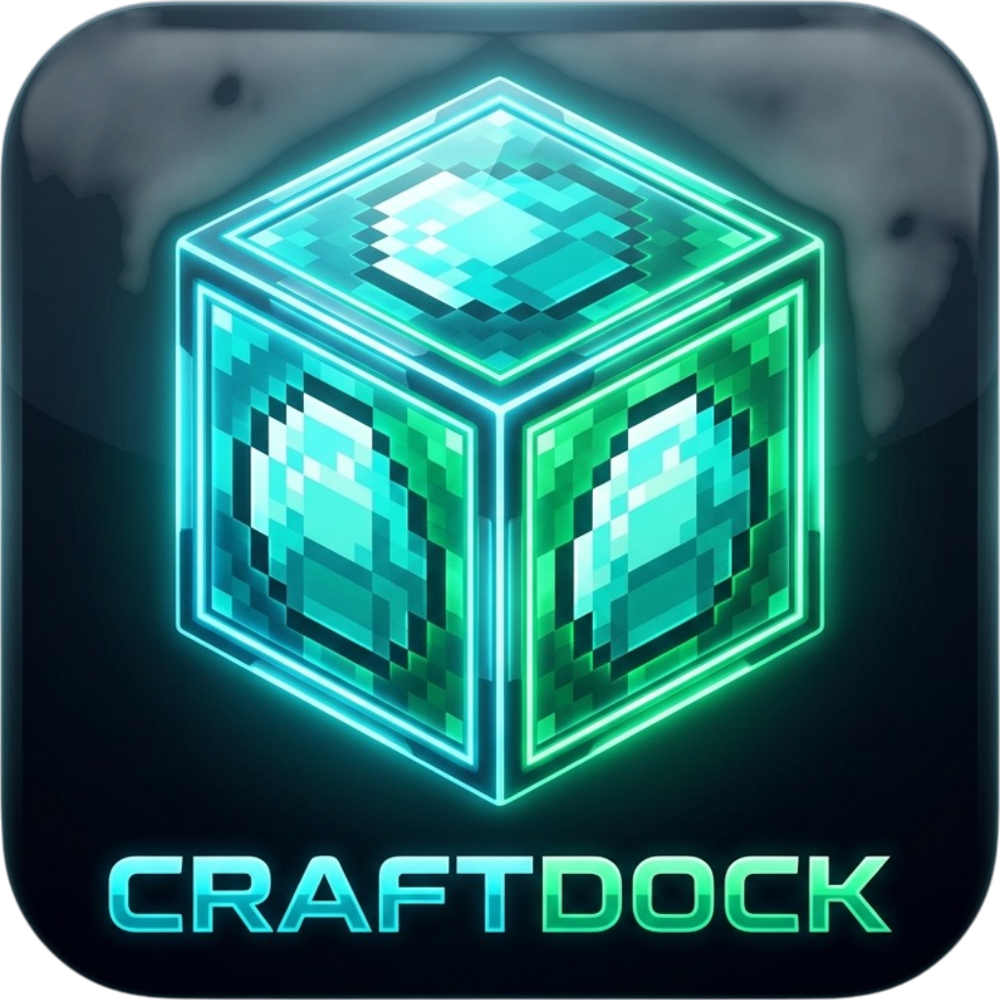

# 🎮 CraftDock — Next-Gen Minecraft Server Manager

<div align="center">
  
  <h1 style="margin-top: 12px; margin-bottom: 4px;">CraftDock v2.2.8</h1>
  <p><b>The ultimate, ultra-fast, and beautiful desktop Minecraft Server Manager for Windows & macOS.</b></p>
  <p><i>Host, optimize, customize, and play with friends in under 60 seconds — 100% on your own hardware, zero subscription fees.</i></p>

  <p>
    <a href="https://github.com/itsnotsimple/craftdock/releases/latest"></a>
    
    
    
    
  </p>

  <p>
    <a href="#-quick-download"><b>⚡ Quick Download</b></a> •
    <a href="#-key-features"><b>✨ Features</b></a> •
    <a href="#-motd-designer"><b>🎨 MOTD Designer</b></a> •
    <a href="#-global-settings--automation"><b>⚙️ Automation</b></a> •
    <a href="#-development--building"><b>🛠️ Development</b></a> •
    <a href="#-faq"><b>❓ FAQ</b></a>
  </p>
</div>

---

## ⚡ Quick Download

Download the official compiled release for your operating system:

| Platform | Processor Architecture | Download Link |
|:---|:---|:---|
| 🪟 **Windows** | 64-bit (x64) | [**`CraftDock-2.2.8-Windows-Setup.exe`**](https://github.com/itsnotsimple/craftdock/releases/latest) |
| 🍏 **macOS** | Apple Silicon (**M1 / M2 / M3 / M4**) | [**`CraftDock-2.2.8-macOS-AppleSilicon-M-Chips.dmg`**](https://github.com/itsnotsimple/craftdock/releases/latest) |
| 🍏 **macOS** | Intel Processor (x64) | [**`CraftDock-2.2.8-macOS-Intel.dmg`**](https://github.com/itsnotsimple/craftdock/releases/latest) |

> [!TIP]
> **🍏 First-Time Launch on macOS (Apple Gatekeeper):**  
> Because CraftDock is a free community project, macOS may show a security notice on first launch (*"CraftDock is damaged and can't be opened"*).  
>
> To allow normal double-clicking, drag CraftDock to your **Applications** folder, open **Terminal**, and run:
> ```bash
> xattr -cr /Applications/CraftDock.app
> ```
> *(Or navigate to **System Settings ➔ Privacy & Security ➔ Security** and click **Open Anyway**).*

---

## ✨ Key Features

### 🚀 1-Click Server Wizard
* **All Major Engines Supported**: **PaperMC**, **Purpur**, **Fabric**, and pure official **Vanilla Mojang**.
* **Live API Version Resolver**: Automatically queries official feeds for Minecraft 1.21.x, 1.20.x down to legacy releases.
* **On-Demand Minimal Storage**: Downloads binaries only when you need them.

### ☕ Automated Portable Java Environment (Adoptium OpenJDK)
* **Zero Manual Java Setup**: CraftDock detects the exact Java runtime required for your Minecraft version and downloads portable Adoptium Temurin JDKs into isolated directories:
  * **Java 21 / 25**: Minecraft 1.20.5+ through 1.21.x and future snapshots.
  * **Java 17**: Minecraft 1.17 – 1.20.4.
  * **Java 8**: Legacy Minecraft 1.16.5 and older.
* **Aikar's Flags Integrated**: Optional 1-click toggle for Aikar's tuned G1GC garbage collection parameters to permanently eliminate tick stutter and memory stalls.

### 🎨 Live Minecraft MOTD Designer & Preview Screen
* **Pixel-Perfect Screen Compiler**: Authentic Minecraft multiplayer server list preview with genuine fonts, ping indicators, and server status.
* **Full Formatting Palette**: 16 standard Minecraft colors (`§0`–`§f`), styles (Bold, Italic, Strikethrough, Underline, Obfuscated `§k`).
* **5 Ready-to-use Presets**:
  * ⚔️ *Survival SMP*
  * 👥 *Friends Realm*
  * 🌐 *Crossplay Java + Bedrock*
  * 💀 *Hardcore Permadeath*
  * ✨ *Clean Vanilla*
* **Special Unicode Symbols**: 1-click insert for stars (`★`), swords (`⚔`), hearts (`❤`), shields, arrows, and borders.

### 🌐 Zero-Config Global Multiplayer (Playit.gg Embedded Tunnel)
* **Play With Friends Anywhere**: No port forwarding, no router admin login, no exposing your private home IP.
* **Embedded Tunnel Engine**: Launches a secure tunnel with 1 click and gives you a shareable `*.joinmc.link` address.
* **Local LAN Support**: Automatic local Wi-Fi IP detector for zero-latency LAN parties.

### 🧩 Modrinth Integration & Curated Plugins
* **Modrinth API Browser**: Search, filter, and install mods, plugins, and resource packs directly from Modrinth with live download metrics.
* **Curated 1-Click Essentials**:
  * **GeyserMC & Floodgate**: Seamless crossplay allowing Bedrock players (iOS, Android, Xbox, PlayStation, Switch) to join your Java world.
  * **SkinsRestorer**: Full player skin support for offline/cracked servers.
  * **EssentialsX**: Full suite of `/sethome`, `/spawn`, `/tpa`, and economy commands.
  * **ViaVersion**: Backwards/forwards compatibility across client versions.
  * **Chunky**: Pre-generates terrain chunks to eliminate flight and elytra generation lag.
* **Resource Pack Manager**: Direct HTTP links with automatic prompt and mandatory hash integration.

### 🤖 Smart Automations & System Tray
* **Crash Detection & Auto-Restart**: Automatically recovers and restarts servers if they crash unexpectedly.
* **Auto-Start Last Server on App Launch**: Immediately boots your last played world upon opening CraftDock.
* **Minimize to System Tray**: Keeps servers running in the background when clicking **(X)**, with a friendly 1-time notification.
* **GitHub Auto-Updater**: Checks for updates from [`itsnotsimple/craftdock`](https://github.com/itsnotsimple/craftdock) and notifies you with a 1-click download banner.

### 🛡️ Hardware Safeguards & Server Protection
* **Single-Server Concurrency Lock**: Strictly enforces 1 running server at a time to prevent port `25565` collisions and memory exhaustion.
* **Dynamic RAM Advisor**: Reads host RAM and recommends safe minimum and maximum allocations based on player capacity.
* **Storage Quota Sliders**: Set world quota limits (5GB – 100GB+) with breakdown charts (World, Plugins, Backups, Logs).
* **64x64 Icon Auto-Cropper**: Upload any image (PNG, JPG, WEBP); CraftDock automatically resizes and converts it to Minecraft's exact `server-icon.png` base64 format.
* **1-Click World Backups**: Instant compressed `.zip` snapshots stored in your local backups directory.

### 🌓 Dual Themes & Bilingual UI
* **Dark Obsidian** (Glassmorphic) & **Light Ice** (Clean White) themes.
* Full bilingual support: **English (EN)** and **Bulgarian (BG)** toggleable in 1 click.

---

## 🛠️ Development & Building

### Prerequisites
* **Node.js** v20.x or v22.x
* **npm** v10+

### 1. Clone the repository
```bash
git clone https://github.com/itsnotsimple/craftdock.git
cd craftdock
```

### 2. Install dependencies
```bash
npm install
```

### 3. Start development mode
```bash
npm run dev
```

### 4. Production builds
```bash
# Build TypeScript and Vite renderer
npm run build

# Package Windows installer (.exe)
npm run dist:win

# Package macOS Disk Images (.dmg for Apple Silicon and Intel)
npm run dist:mac
```

---

## 📁 Architecture

```text
craftdock/
├── .github/workflows/          # Automated multi-platform GitHub Actions release CI
├── resources/                  # App icon (.png, .ico) and native binary assets
├── src/
│   ├── main/                   # Electron Main Process (Node.js)
│   │   ├── main.ts             # Window lifecycle, System Tray, IPC dispatch, Updater
│   │   ├── preload.ts          # ContextBridge security barrier & typed API exports
│   │   ├── app-settings.ts     # Global configuration, network & disk diagnostics
│   │   ├── api-service.ts      # Paper/Purpur/Fabric/Vanilla & Modrinth API clients
│   │   ├── java-manager.ts     # Automatic Adoptium OpenJDK runtime downloader
│   │   ├── server-runner.ts    # Child process management, live log streaming, CPU/RAM metrics
│   │   ├── server-config.ts    # server.properties read/write & plugin installation
│   │   ├── server-store.ts     # JSON persistence for server profiles & storage metrics
│   │   ├── system-info.ts      # Host hardware metrics (RAM, CPU, IP addresses)
│   │   └── tunnel-service.ts   # Embedded Playit.gg agent controller
│   │
│   └── renderer/               # React 18 Application (Vite)
│       └── src/
│           ├── components/     # TitleBar, Sidebar, MotdEditor, StorageSlider, ConsoleView...
│           ├── views/          # LibraryView, WizardView, DashboardView, SettingsView
│           ├── context/        # ThemeContext, LanguageContext, DialogContext
│           ├── i18n/           # Bilingual translations (EN / BG)
│           ├── types/          # Full TypeScript interfaces
│           └── styles/         # Tailwind CSS & Glassmorphism design tokens
├── package.json
└── tsconfig.json
```

---

## ❓ FAQ

<details>
<summary><b>Why is the Fabric server download only ~182 KB while Paper/Vanilla are ~60 MB?</b></summary>
<br>
The official Fabric server JAR is a lightweight <b>bootstrap installer shim (~182 KB)</b>. When you start a Fabric server for the first time, Fabric automatically connects to Mojang, downloads the vanilla server JAR and dependencies into <code>.fabric/</code> and <code>libraries/</code>, and patches them in memory. Paper and Vanilla, by contrast, are bundled monolithic ("fat") JARs containing all game files up front.
</details>

<details>
<summary><b>Do my friends need CraftDock to join my server?</b></summary>
<br>
<b>No!</b> CraftDock runs the standard Minecraft server. Your friends simply use their regular Minecraft client (Java Edition or Bedrock Edition if Geyser is enabled) and paste the server address or Playit tunnel link into their multiplayer list.
</details>

<details>
<summary><b>Can friends with cracked / TLauncher accounts connect?</b></summary>
<br>
<b>Yes!</b> In your server's settings tab, simply switch <b>Online Mode</b> to <code>Disabled (Offline/Cracked)</code>. You can also install the 1-click <b>SkinsRestorer</b> plugin so cracked accounts have their custom skins displayed.
</details>

<details>
<summary><b>How does Minimize to Tray work?</b></summary>
<br>
When <code>Minimize to Tray</code> is enabled in Settings, clicking the window close button <b>(X)</b> hides CraftDock into the Windows notification tray (next to the clock) or macOS menu bar. Your Minecraft servers will stay online uninterrupted until you explicitly choose <b>Quit CraftDock</b> from the tray menu.
</details>

<details>
<summary><b>Why does macOS say "CraftDock is damaged and can't be opened"?</b></summary>
<br>
This is standard macOS Gatekeeper behavior for free open-source software downloaded outside the Mac App Store. The app is completely safe and undamaged. Simply drag CraftDock to <b>/Applications</b>, open <b>Terminal</b>, and execute:
<pre><code>xattr -cr /Applications/CraftDock.app</code></pre>
Once run, CraftDock will launch with a normal double-click forever.
</details>

---

## 📜 License & Credits

Distributed under the **MIT License**. Created with ❤️ for the Minecraft community.
CraftDock is not affiliated with Mojang Studios or Microsoft.
